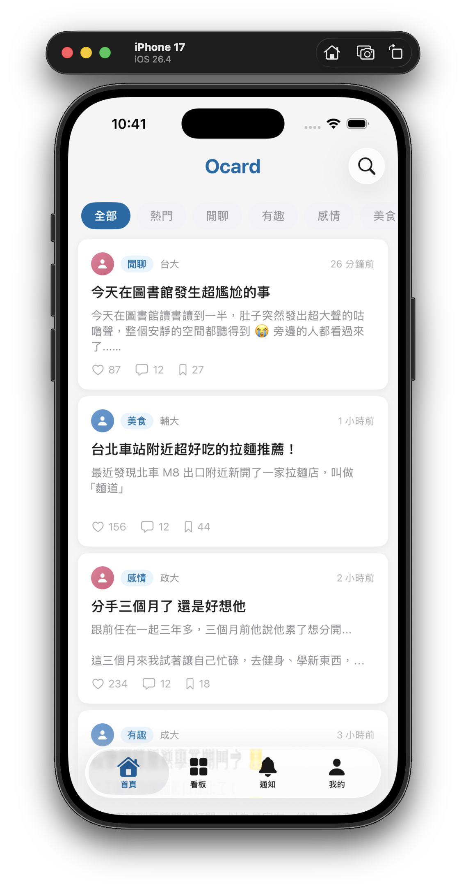
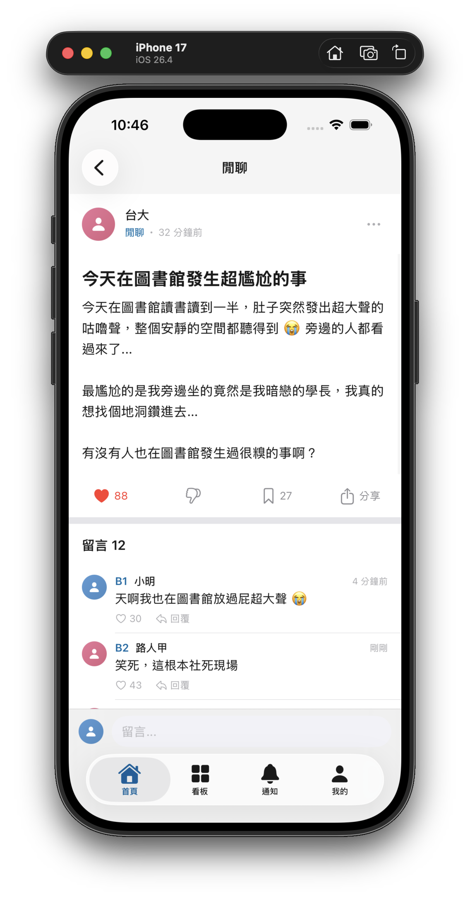
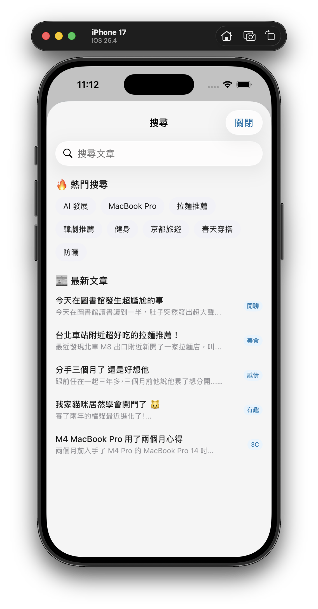

# 🎯 Ocard — 仿 Dcard 社群論壇 App

以 SwiftUI 重現 Dcard 介面設計的 iOS 課程作業

## 📖 專案背景

本專案為台科大大四下學期 iOS 開發課程作業二（HW2 App UI），作業要求：

> 挑選一款市面上的 App，思考其畫面排版方式，並嘗試自行重現其畫面。
> **主要是 UI 介面的重現，功能是其次，可以先寫死。**

我選擇了 **Dcard** 作為模仿對象，使用純 SwiftUI 盡力還原其介面風格與互動體驗。本專案**以 UI 呈現為核心**，部分功能僅為展示用途（如搜尋、通知、分享等為靜態模擬），資料為本地 Mock 資料，並非連接後端 API。


## ✨ 已實作的畫面與功能

### UI 重現
- 📱 首頁文章動態牆（含看板篩選 Chip）
- 📋 看板列表與看板詳情頁
- 📝 文章詳情頁（含留言區）
- ✍️ 發文頁面
- 🔍 搜尋頁面
- 🔔 通知頁面
- 👤 個人頁面（三分頁：我的文章/收藏/留言紀錄）
- ✏️ 編輯個人資料頁面

### 有實際互動的功能（Bonus）
- 按讚 / 倒讚（互斥切換）
- 收藏文章（含次數統計）
- 留言 + 回覆特定樓層（Dcard 建樓風格）
- 發文（選看板 → 標題/內容 → 發佈）
- 看板訂閱/取消
- 個人資料編輯
- 使用 **UserDefaults** 持久化儲存

### 僅為 UI 展示（寫死/模擬）
- 搜尋功能（有介面，基本篩選）
- 通知（靜態 Mock 資料）
- 分享按鈕（佔位）
- 照片/相機/表情等工具列按鈕（佔位）


## 📸 畫面預覽

| 首頁 | 點進文章 | 搜尋 PO 文 |
|:---:|:---:|:---:|
|  |  |  |

本專案 UI 設計參考 [Dcard](https://www.dcard.tw/) iOS App。


## 🛠 技術棧

| 項目 | 技術 |
|------|------|
| UI 框架 | SwiftUI |
| 狀態管理 | Swift Observation（`@Observable`） |
| 最低版本 | iOS 17+ |
| 資料持久化 | UserDefaults + Codable |
| 導航 | NavigationStack |


## 📂 專案結構

```
Hw2_AppUI/
├── ContentView.swift      # 主畫面（4 Tab）
├── DataStore.swift        # 資料管理（Mock 資料 + 業務邏輯）
├── Theme.swift            # 主題樣式 + Dcard 風格頭像元件
├── Models/                # 5 個資料模型
└── Views/                 # 10 個畫面元件
```

> 📘 完整的技術細節、架構設計、API 列表請參考 [DEVELOPMENT.md](./DEVELOPMENT.md)


## 🚀 快速開始

```bash
open Hw2_AppUI.xcodeproj
# 選擇模擬器 → ⌘R 即可執行
```

- 首次啟動自動產生 Mock 資料（15 篇文章 + 180 則情境留言）
- 資料儲存在 UserDefaults，重開 App 資料仍在
- 如需重置：刪除 App 重新安裝


## 📄 License

本專案為課程作業用途，僅供學習參考。
